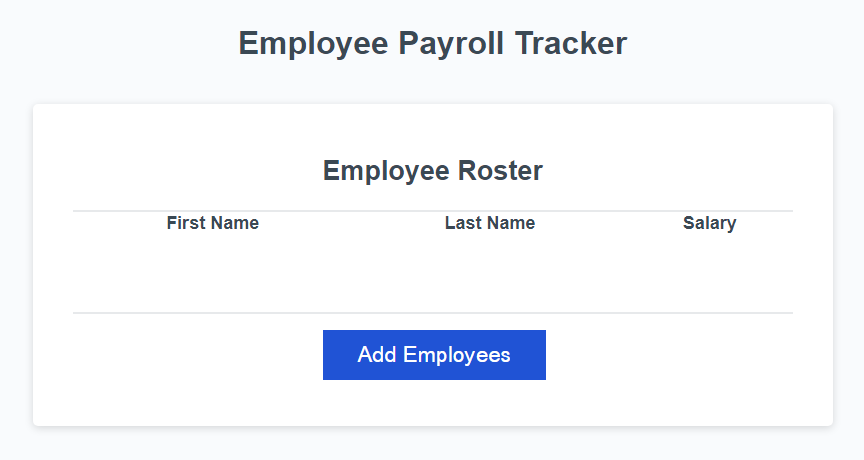

# JavaScript Challenge: Employee Payroll Tracker

Click image of application preview to access application!

URL: [https://anaz0004.github.io/module-3-challenge/](https://anaz0004.github.io/module-3-challenge/)
## User Story

* AS A payroll manager
* I WANT AN employee payroll tracker
* SO THAT I can see my employees' payroll data and properly budget for the company

## Acceptance Criteria

* GIVEN an employee payroll tracker
* WHEN I click the "Add employee" button
* THEN I am presented with a series of prompts asking for 
    - [x] first name
    - [x] last name
    - [x] salary
* WHEN I finish adding an employee
* THEN I am prompted 
    - [x] to continue or cancel
* WHEN I choose to continue
* THEN I am prompted to 
    - [x] add a new employee
* WHEN I choose to cancel
* THEN my employee data is 
    - [x] displayed on the page sorted alphabetically by last name, and the console shows computed and aggregated data
